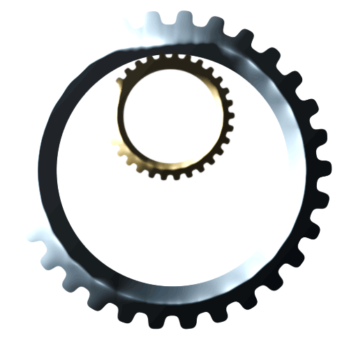

#  Welcome to my Github!

    
    
    
    

##  Something about me

My name is Pasquale Convertini and I am a Software Engineer with a passion for coding and cybersecurity. Here some info about me:

 

- 📠I'm from Italy, but besides pizza , I also like playing **CTFs** and **coding challenges**;
- ⚙️ I'm currently working as a **Full Stack Engineer**;
- 🐧 I'm a **Linux** lover;
- 🔑 I'm currently learning **Blockchain**;
- 📙 I like **cybersec** and **algorithm-related** books. 

 

##  Technologies and Tools
<!--
**pasquale95/pasquale95** is a ✨ _special_ ✨ repository because its `README.md` (this file) appears on your GitHub profile.

Here are some ideas to get you started:

- 🔭 I’m currently working on ...
- 🌱 I’m currently learning ...
- 👯 I’m looking to collaborate on ...
- 🤔 I’m looking for help with ...
- 💬 Ask me about ...
- 📫 How to reach me: ...
- 
- ⚡ Fun fact: ...
-->
